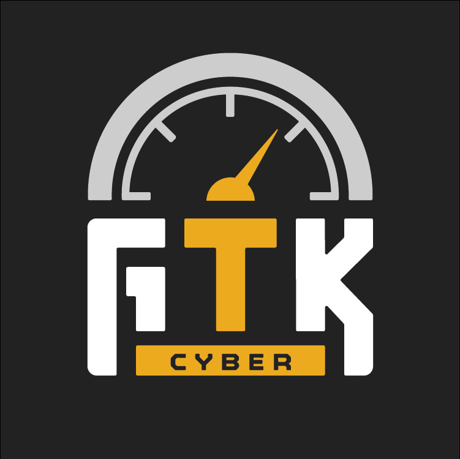

# AI Cyber Bootcamp

### 2026 Trainings Presented by GTK Cyber

GTK Cyber [www.gtkcyber.com](https://www.gtkcyber.com) was founded to bridge the gap between Data Science and Cyber Security and not only provide high standard hands-on trainings, but introduce students to the most cutting-edge technologies and advancements in artificial intelligence, all with a focus on direct applicability to cyber security.

### Instructors

- Charles Givre - Data Scientist:  charles.givre@gtkcyber.com
- Curtis Lambert - Instructor & Data Scientist: curtis@gtkcyber.com
- Ajay Pillai - Instructor & Neuroscientist: ajay@gtkcyber.com
- Summer Rankin - Instructor & Solution Architect: summer@gtkcyber.com
- Tim Swagger - Instructor & Sr. Software Engineer: tim@gtkcyber.com

#### Teaching Assistant
- Hannah Hesselberg - Teaching Assistant: hannah@gtkcyber.com

## Course Setup

Course setup can be found [here](SETUP.md).

## Labs
* [Worksheet 1.1 - Vectorized Data Structures](notebooks/Worksheet_1.1_Vectorized_Data_Structures.ipynb)
* [Worksheet 2.1 - Data Visualization](notebooks/Worksheet_2.1_Data_Visualization.ipynb) 
* [Worksheet 2.2 - Interactive Visualizations](notebooks/Worksheet_2.2_Interactive_Visualizations.py)
* [Worksheet 3.1 - Feature Engineering](notebooks/Worksheet_3.1_Feature_Engineering.ipynb)
* [Worksheet 4.1 - DGA Detection Using Supervised Learning](notebooks/Worksheet_4.1_DGA_Detection_using_Supervised_Learning.ipynb)
* [Worksheet 4.2 - Tuning Your Classifier](notebooks/Worksheet_4.2_Tuning_Your_Classifier.ipynb)
* [Worksheet 4.3 - Automate It All](notebooks/Worksheet_4.3_Automate_It_All.ipynb)
* [Worksheet 5.1 - Clustering](notebooks/Worksheet_5.1_Clustering.ipynb)
* [Worksheet 6.1 - Anomaly Detection](notebooks/Worksheet_6.1_Anomaly_Detection.ipynb)
* [Worksheet 7.1 - Deep Learning CNN Fingerprints](notebooks/Worksheet_7.1_Deep_Learning_CNN_Fingerprints.ipynb)
* [Worksheet 7.2 - Deep Learning RNN URL](notebooks/Worksheet_7.2_Deep_Learning_RNN_URL.ipynb)
* [Worksheet 8.1 - Attacking AI](notebooks/Worksheet_8.1_Attacking_AI.ipynb)
* [Worksheet 9.1 - Classification with Embeddings](notebooks/Worksheet_9.1_Classification_with_Embeddings.ipynb)
* [Worksheet 9.2 - Unsupervised Learning with Embeddings](notebooks/Worksheet_9.2_Unsupervised_Learning_with_Embeddings.ipynb)
* [Worksheet 9.3 - PyTorch in 20 Minutes](notebooks/Worksheet_9.3_PyTorch_in_20_Minutes.ipynb)
* [Worksheet 9.4 - Tokenizers and Embeddings](notebooks/Worksheet_9.4_Tokenizers_and_Embeddings.ipynb)
* [Worksheet 9.5 - Attention and Your First GPT](notebooks/Worksheet_9.5_Attention_and_Your_First_GPT.ipynb)
* [Worksheet 9.6 - Fine-Tuning and Poisoning](notebooks/Worksheet_9.6_Fine_Tuning_and_Poisoning.ipynb)
* [Worksheet 10.1 - Programmatic LLM Interaction](notebooks/Worksheet_10.1_Programmatic_LLM_Interaction.ipynb)
* [Worksheet 10.2 - Classification with LLMs](notebooks/Worksheet_10.2_Classification_with_LLMs.ipynb)
* [Worksheet 11.1 - AI RAG CVEs](notebooks/Worksheet_11.1_AI_RAG_CVEs.ipynb)
* [Worksheet 11.2 - Building Agent Tools](notebooks/Worksheet_11.2_Building_Agent_Tools.ipynb)

### Recommended Readings
   - [Python for Data Analysis](http://shop.oreilly.com/product/0636920023784.do)
   - [Data Science for Business](http://shop.oreilly.com/product/0636920028918.do)
   - [Creating a Data-Driven Organization](http://shop.oreilly.com/product/0636920035848.do)
   - [Data-Driven Security](http://datadrivensecurity.info/)
   - [Mastering Machine Learning with scikit-learn](https://www.packtpub.com/big-data-and-business-intelligence/mastering-machine-learning-scikit-learn)
   - [Hands-On Machine Learning with Scikit-Learn and TensorFlow](http://shop.oreilly.com/product/0636920052289.do)
   - [Learning Apache Drill](https://amzn.to/2M8Peo6)
   - [Deep Learning](http://www.deeplearningbook.org/)
